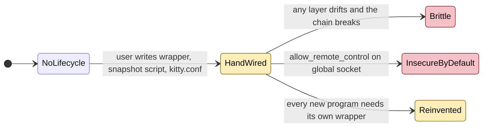
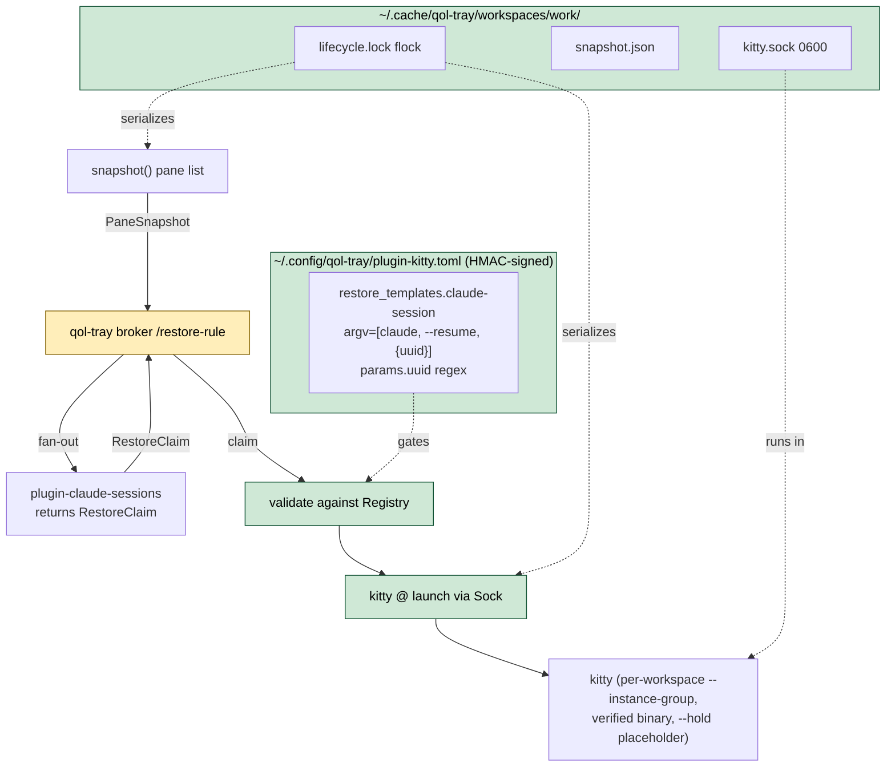
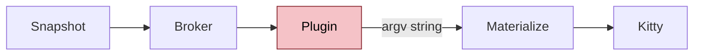

# KITTY-1 Build Plugin Kitty Terminal Lifecycle

- **Status:** Proposed
- **Issue:** #1
- **Date:** 2026-05-12
- **Related:** Epic qol-tray#31, contract API-1 (qol-plugin-api#2)
- **Design spec:** `workspace/docs/superpowers/specs/2026-05-12-terminal-workspace-restore-design.md` (plugin-kitty section)

## Problem

A user runs 6 to 12 Claude Code sessions inside one kitty window across splits. Today, snapshotting and restoring that layout requires a hand-wired stack: a `cc` wrapper that tags each kitty window via `kitty @ set-user-vars`, a snapshot script that emits a kitty `--session` config, a `kitty.conf` edit enabling `allow_remote_control` plus a stable `listen_on` socket, and a task-runner action that glues everything together. The installation surface is too high for a "qol-tray gives you this for free" experience, and the responsibilities are scattered across four artifacts the user must wire by hand.

The deeper problem is generic: any program with persistent state on disk (psql sessions, tmux servers, ssh sockets, IDE workspaces, browser tabs) hits the same "snapshot the terminal, resume each program from its own state" pattern. Solving it once for Claude in a Claude-aware fashion would repeat the same scaffolding for every future program.

This issue scopes the **plugin-kitty** half of the solution: the terminal lifecycle owner. It depends on the contract carried by qol-plugin-api PR API-1 (`PaneSnapshot`, `RestoreClaim`, `RestoreRuleCapability`). The sibling plugin-claude-sessions and the broker work in qol-tray are tracked separately under the parent epic qol-tray#31.

| ID | State | Smell |
|----|-------|-------|
| KITTY-1.1 | 🔴 Broken | No first-class terminal lifecycle: snapshot and restore live in user-maintained shell scripts that drift with kitty releases. |
| KITTY-1.2 | 🔴 Broken | `allow_remote_control` is enabled globally in `kitty.conf` and the listen socket is shared across all kitty instances, instead of per-workspace isolated sockets at mode 0600. |
| KITTY-1.3 | 🟡 Leaky | Workspace state has no canonical on-disk layout: snapshots, sockets, and locks land wherever the user's scripts choose, with no concurrent-reboot protection. |
| KITTY-1.4 | 🟡 Leaky | The kitty binary is resolved via `PATH`, with no codesigning check on macOS and no package-manager verification on Linux; any earlier `kitty` shim on `PATH` is silently honoured. |
| KITTY-1.5 | 🟡 Leaky | Restoring panes requires emitting a kitty `--session` file, which kitty re-tokenizes; title and cwd values cross a parser boundary that requires shell-style escaping. |
| KITTY-1.6 | 🟡 Leaky | Authority over which programs may run after a workspace reboot lives in whatever the snapshot script chooses to print; there is no template registry, no per-parameter regex, and no audit trail. |
| KITTY-1.7 | 🟡 Leaky | Pattern is Claude-specific by accident: there is no reusable bridge contract that future plugins (psql, tmux, ssh, browser) could plug into without reinventing the lifecycle. |

> Severity: 🔴 bad (broken / silent failure / data loss) - 🟡 warn (leaky / race / brittle) - 🟢 good (used in proposal diagrams to mark what is now safe)

## Proposals

### Proposal A - Template-gated kitty lifecycle plugin `[heavy]`

Ship `plugin-kitty` as the single owner of terminal lifecycle: workspace state on disk, per-workspace kitty IPC socket, trusted-binary discovery, snapshot via `kitty @ ls --format=json`, and pane materialization via IPC launch calls (no session file). Authority over which programs may run after reboot lives in plugin-kitty's HMAC-signed template registry; plugins consume the `restore-rule` capability from qol-plugin-api (PR API-1) and supply only typed `RestoreClaim { template_id, params }` values that pass per-parameter regex validation.

Key sub-decisions inherited from the design spec:

- **Workspace state on disk**: per-workspace dir at `~/.cache/qol-tray/workspaces/<name>/` mode 0700 holding `kitty.sock` 0600, `snapshot.json` for debug, and `lifecycle.lock` (flock) to serialize concurrent reboot triggers. All filesystem access via `cap_std::fs::Dir::open_ambient_dir` plus openat-anchored syscalls; the path string is never re-traversed. Workspace name validated against `^[a-z0-9][a-z0-9-]{0,31}$`.
- **Template registry**: each entry carries an HMAC-SHA256 over its canonical body; key generated by `getrandom` and stored via the `keyring` crate (macOS Keychain, Linux Secret Service, Windows Credential Manager). HMAC mismatch blocks startup with a `registry sign` funnel. Audit log is JSONL with an HMAC chain (`prev_hmac` + `entry_hmac`); truncation breaks the chain.
- **Trusted-binary discovery**: macOS resolves via known bundle locations and verifies with `codesign-verify-rs` against a designated requirement string pinning Apple anchor plus kitty team id plus `net.kovidgoyal.kitty`. Linux queries `dpkg`/`pacman`/`rpm` and verifies package integrity (`dpkg --verify` / `pacman -Qkk` / `rpm -V`). Both paths pin the resolved path in the signed registry; subsequent spawns re-verify. PATH-resolved fallback only with explicit override entry.
- **kitty spawn**: verified binary launched with `--single-instance=no`, `--instance-group=qol-tray-<workspace>`, `--override allow_remote_control=yes`, `--override listen_on=unix:<sock_path>`, `--hold -- true`. No `--session` flag. `env_clear()` plus small env allowlist.
- **Snapshot**: `kitty @ --to "unix:<sock>" ls --format=json` with 1s timeout, parsed via serde. Per pane: cwd resolved via realpath and validated under `$HOME`; title stripped of control chars and truncated to 256 bytes; foreground is deepest non-shell process.
- **Pane materialization**: one `kitty @ launch` IPC call per pane, argv after `--` so kitty receives a typed array (no re-tokenization). Title and cwd cross the OS argv boundary as opaque bytes; no shell quoting, no parser to fool. Pane layout reconstructed by sequencing launch calls in snapshot order with `--type=tab` and `--location=hsplit|vsplit`; `kitty @ goto-layout` between tabs. Placeholder `--hold true` window closed via `kitty @ close-window --match recent:0` after materialization.
- **Template substitution**: every `{name}` resolves to a built-in (`HOME`, `USER`, `pane_cwd`, `pane_title`) or to a key in the plugin's returned `params`. Each value validated as ASCII bytes against the declared regex. Unsubstituted braces, extra params, missing required params, or regex mismatches drop the claim and fall back to a plain shell launch.
- **Dangerous templates**: any template whose `argv[0]` resolves to `sh`/`bash`/`zsh`/`fish`/`python`/`node`/`ruby`/`perl` (or contains `eval`/`exec`) is flagged `dangerous = true`, requires interactive confirmation at add-time, and triggers a full review panel on every reboot even after the first.
- **Suggestion flow**: plugin manifests may carry `[suggested_restore_templates]`; plugin-kitty surfaces each suggestion at install with the template body inline. Approval writes both body and HMAC; the plugin never touches the file.

| Pros | Cons |
|------|------|
| User owns program identity by construction: no plugin can introduce a new program, only fill named slots in user-approved templates. | Heavy lift: cap-std plumbing, HMAC chain plus keyring integration, two-OS trust paths (macOS codesign, Linux package verify), and full kitty IPC orchestration. |
| Workspace state has one canonical layout, per-workspace sockets at 0600, and flock-serialized reboots. | Suggestion flow adds a new install-time prompt surface that users must learn. |
| Pane materialization crosses no shell parser; title and cwd are byte-opaque through Command::arg + kitty protocol fields. | Pixel-perfect split ratios are not preserved (kitty IPC reconstructs to layout-aware granularity, not exact geometry). |
| Generic bridge: future plugins (psql, tmux, ssh, browser) reuse the same `restore-rule` capability without touching plugin-kitty internals. | Manual `kitty install` outside a recognized package manager triggers a one-time UI warning and a manual override entry. |
| HMAC plus audit chain mean tampering with the template registry is detected at startup, not at restore time. | Initial template registry ships only `claude-session`; further useful templates require a follow-up wave of suggestion-flow approvals. |

**Closes:** KITTY-1.1, KITTY-1.2, KITTY-1.3, KITTY-1.4, KITTY-1.5, KITTY-1.6, KITTY-1.7

---

### Proposal B - Thin kitty wrapper, plugin-supplied argv `[medium]`

Ship plugin-kitty as a thinner orchestrator: snapshot panes, fan out to plugins via the broker, and accept full `argv` strings back from plugins (no template registry, no HMAC). The plugin returns "here is the command to run for this pane"; plugin-kitty splices it into a `kitty @ launch` call.

| Pros | Cons |
|------|------|
| Smaller scope: no template registry, no HMAC chain, no keyring integration; ships sooner. | Authority over which programs may run after reboot lives in plugin code, not user-owned config: a compromised plugin can introduce arbitrary programs. |
| Plugin authors write less code (no template suggestions, no slot validation). | Violates the spec's "Principle: user owns program identity" - the single most important architectural decision in the parent design. |
| Existing user-written `cc` wrapper flow ports almost directly to a plugin. | No bounded blast radius per plugin: every plugin has the same authority as a malicious one. |

**Closes:** KITTY-1.1, KITTY-1.3, KITTY-1.5

---

**Recommended:** A. The whole point of the parent design is that program identity stays user-owned and plugin authority is bounded per-slot. Proposal B collapses that boundary and is listed only as a foil.

## Notes

- This is one of three parallel-after-contract sub-issues in the terminal-workspace-restore epic (qol-tray#31). The contract it depends on (`PaneSnapshot`, `RestoreClaim`, `RestoreRuleCapability`) lives in qol-plugin-api PR API-1 and must merge before pane materialization can be wired end-to-end.
- The plugin-claude-sessions design (PID-resolution to uuid, exe-name match rules, manifest with `[suggested_restore_templates]` for `claude-session`) is tracked in a separate sub-issue and consumes plugin-kitty's registry rather than altering it.
- Security analysis - cross-plugin IPC auth, malicious restore-rule plugin, registry tampering, workspace-name to path injection, symlink/TOCTOU on workspace dirs, title/cwd injection, process spoofing, PaneSnapshot information disclosure, concurrent reboot races, DoS via slow plugin, kitty binary lookup, Unix socket access on shared machines, sensitive content in .jsonl, plugin auto-install trust - is fully enumerated in the design spec's "Security analysis" section (Threat model + 14 numbered risks + Defense-in-depth + Risk summary). The ADR's Proposal A inherits every mitigation; new risks discovered during implementation get appended here.
- Pixel-perfect split-ratio preservation is explicitly out of scope (parent design Non-goals). The expressive limit is what `kitty @ launch` plus layout-aware commands can reconstruct.
- Cross-machine restore is out of scope; workspaces are local-host only.
